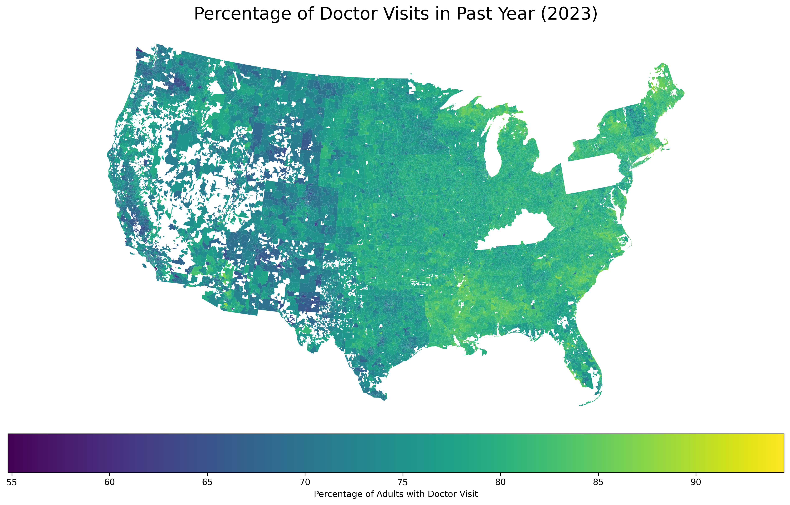

# Abstract (to be completed for final report)

Background:

Objective: To quantify the impact of immigration enforcement intensity on health care utilization among immigrant populations, specifically evaluating whether the removal of "sensitive location" protections and increased ICE activity function as structural barriers to medical and preventive care.

Methods:

Results:

Conclusions:

# Introduction

<!--# Required for midterm -->

Immigration-related fears appear to be negatively affecting health care access in the United States [@KFFSurvey2025]. Recent survey evidence indicates that nearly half (48%) of likely undocumented immigrant adults and 14% of immigrant adults overall report that they or a family member have avoided seeking medical care due to immigration-related concerns. These findings suggest that immigration enforcement may function as a structural barrier to health care access, even for individuals who are not directly targeted by enforcement actions. In January 2025, federal policy changes reversed prior protections that designated hospitals and other health care facilities as “sensitive locations,” limiting enforcement activity in these settings [@DHSStatement2025]. The removal of these protections may plausibly increase fears associated with seeking care, particularly in communities with visible or intensified U.S. Immigration and Customs Enforcement (ICE) activity.

Motivated by these developments, this project investigates the relationship between immigration enforcement intensity and health care utilization. Specifically, we seek to answer the question: *Does increased ICE enforcement correlate with reduced health care utilization?* We hypothesize that higher levels of local enforcement activity are associated with greater health care avoidance, as individuals may be less willing to leave their homes or engage with formal institutions perceived as potential sites of immigration enforcement.

## Literature Review

Empirical research provides strong evidence that immigration enforcement activity reduces health care utilization among immigrant populations. At the state level, Hispanic patients were significantly less likely to report having a regular provider or annual checkup following increased ICE activity, a pattern not observed among non-Hispanic adults [@Friedman2021]. This differential response underscores how enforcement intensity functions as a racialized barrier to care. A more dramatic illustration comes from research on Secure Communities, an immigration enforcement program expanded during the Obama administration from 2008 to 2014, which found that likely authorized Hispanic immigrants experienced a 16.9% decline in the probability of visiting a health care provider compared to non-Hispanic U.S.-born respondents [@Herring2025]. Complementing these state-level findings, a survey of Asian and Latinx immigrants in California demonstrated that each additional direct experience with immigration enforcement was associated with delayed care for both groups [@Young2023].

Beyond individual-level utilization changes, enforcement has broader structural impacts on health care access. Studies using geographic measures of enforcement intensity, such as ICE detainer requests at the county level, found these requests were associated with lower Medicaid and SNAP enrollment—indicating that enforcement creates barriers to accessing public benefits and formal health care systems [@Kravitz2024]. At the regional level, Latino adults living in areas with the most detainer requests had 24% higher odds of fair/poor self-rated health compared to those in areas with the least requests, reflecting enforcement's effects on health outcomes through reduced care access [@Eastus2025]. These findings align with a comprehensive literature review synthesizing 32 studies, which documented that hostile immigrant environments correlate with decreased or delayed utilization of basic health care services [@Vernice2020].

The mechanisms linking enforcement to reduced care-seeking are increasingly well-understood through provider and qualitative research. Surveys of clinicians consistently show enforcement's disruptive effects: 48% of primary care and emergency medicine providers reported observing negative effects of ICE enforcement on their immigrant patients' health and health access [@Hacker2012], while another survey found that post-2016 anti-immigrant policies and enforcement actions led half of clinicians to report persistent fear among their immigrant patients—an effect more pronounced in border states [@Saadi2021]. Qualitative investigations reveal the emotional and structural pathways through which enforcement affects care-seeking. A 2009 study in Everett, Massachusetts found that enhanced enforcement impacted immigrant health through both emotional means (deportation fears, concerns about ICE-police cooperation) and structural barriers (anxiety about documentation requirements for enrollment and care) [@Hacker2011]. An immigration raid in a Midwestern Latino community similarly demonstrated that enforcement actions increase immigration-related stress and lower self-rated health among affected residents [@Lopez2017].

While prior studies have well-documented enforcement effects through state-level analyses, provider surveys, and local case studies, comprehensive research examining the relationship on a national scale at granular geographic and temporal levels remains limited. This project addresses this gap by using national datasets on ICE detention activity and health care utilization to analyze the enforcement-utilization relationship across geographies and over time, allowing us to quantify a relationship that prior research has established in principle but not comprehensively measured at scale.

# Methods 

See Appendix A for detailed Python code used in data processing and analysis.

## Data

<!--# Description of data sources required for midterm. Descriptive statistics added. Add maps?-->

We utilize data on immigration enforcement, health care utilization data, and social determinants of health. Detention Facilities Average Daily Population data is available from the Transactional Records Access Clearinghouse (TRAC) and provides information on the average daily population of ICE detention facilities, broken down by city, state, ZIP code, and date from September 2019 through present [@TRACDetention2025]. This dataset will allow us to measure the intensity of local immigration enforcement activity over time and across geographies. 

<!--# I think we could remove the following paragraph/dataset from our analysis. -->

This Immigration and Customs Enforcement Detention is also available from TRAC and provides monthly counts of individuals detained by ICE at the county level from March 2015 through July 2019 [@TRACDetention2019]. This data also provides counts of individuals detained by ICE by various subgroups, including citizenship status, facility type, when they entered the facility, conviction level, gender, and more. This dataset will complement the first by providing additional granularity on enforcement activity and allowing us to explore potential differential impacts across subpopulations.

Routine checkup within the past year among adults data is available from CDC's PLACES data and provides information on the percentage of adults who reported having a routine checkup within the past year, broken down by county, ZCTA, and year from 2020-2025 [@PLACES2025]. This dataset will serve as our primary outcome variable, allowing us to assess health care utilization patterns in relation to local enforcement intensity.

We will use data from the American Community Survey (ACS) 5-Year Estimates to control for social determinants of health in our analysis [@CensusAPI]. This data provides information on social determinants of health at the ZCTA level. Social determinants of health analyzed included race, citizenship status, income, education, employment status, and housing conditions.

```{r}
#| label: unique-zctas
#| echo: false
#| warning: false

library(tidyverse)
library(skimr)

panel_data <- read_csv("Data/panel_data.csv") 

unique_zctas <- panel_data |> 
  distinct(zcta5) |> 
  nrow()
```

Our panel data spans from 2018 to 2023 and includes `r format(unique_zctas, big.mark=",")` unique ZIP Code Tabulation Areas (ZCTAs) across the United States. @tbl-summary-statistics provides descriptive statistics for our key variables of interest, including the average daily population in ICE detention facilities, the percentage of adults reporting a routine checkup within the past year, and key social determinants of health across ZCTAs.

```{r}
#| label: tbl-summary-statistics
#| tbl-cap: "Summary statistics"
#| echo: false
#| warning: false

library(tidyverse)
library(skimr)

panel_data <- read_csv("Data/panel_data.csv") 

unique_zctas <- panel_data |> 
  distinct(zcta5) |> 
  pull()

tbl_summ_stats  <- panel_data |>
  select(
    doctor_visits_past_year, 
    pct_population_in_detention,
    pct_hispanic_latino,
    pct_white,
    pct_black,
    pct_asian,
    pct_two_plus,
    pct_other_race,
    pct_non_citizen,
    median_household_income,
    pct_below_poverty,
    pct_unemployed,
    pct_high_school_or_higher,
    pct_no_internet,
    pct_no_vehicle
    ) |>
  rename(
    "Percent of adults who had a visit with a doctor or other health care professional in the past year" = doctor_visits_past_year,
    "Percent of population in ICE detention facilities" = pct_population_in_detention,
    "Hispanic/Latino" = pct_hispanic_latino,
    "White" = pct_white,
    "Black" = pct_black,
    "Asian" = pct_asian,
    "Two or more races" = pct_two_plus,
    "Other race" = pct_other_race,
    "Non-citizen" = pct_non_citizen,
    "Household income" = median_household_income,
    "Below poverty line" = pct_below_poverty,
    "Unemployed" = pct_unemployed,
    "High school education or higher" = pct_high_school_or_higher,
    "Without internet access" = pct_no_internet,
    "Without a vehicle" = pct_no_vehicle
) |> 
  skim_without_charts() |> 
  janitor::clean_names() |> 
  as_tibble() |>
  filter(skim_type == "numeric") |>
  rename(Variable = skim_variable, "Mean" = numeric_mean, "SD" = numeric_sd) |>
  select(Variable, Mean, SD) |>
  mutate(across(where(is.numeric), ~ format(., scientific = FALSE, digits = 1))) |> 
  knitr::kable()

tbl_summ_stats
```

## Geographic Distribution of Health Care Utilization

The following map visualizes the percentage of adults who reported a doctor visit within the past year at the ZCTA level for 2023.

```{r}
#| label: fig_map_doctor_visits
#| fig_cap: "Percentage of Doctor Visits in Past Year (2023)"
#| out.width: "100%"
#| echo: false


## Analysis (in progress)

We plan to use Python to build panel data across datasets, geographies, and years. We will then use modeling techniques to analyze the relationship between immigration enforcement intensity and health care utilization. We will control for potential confounding factors such as socioeconomic status, demographic characteristics, and local health care infrastructure. We will also explore potential heterogeneity in the relationship by subpopulations, such as by citizenship status or facility type. A potential visualization of our analysis could be a series of maps showing the geographic distribution of enforcement intensity and health care utilization, as well as scatter plots or regression lines illustrating the relationship between these variables.

# Results (in progress)

-   Results will identify specific geographic areas in need of health outreach.

-   Findings highlight the hidden public health costs of immigration enforcement.

-   The study provides evidence for maintaining healthcare facilities as safe zones.

-   Research helps clinicians understand why immigrant patients may miss preventive care.

<!--# Should have figures and tables here. -->

# Discussion (in progress)

# Conclusion (in progress)

# References