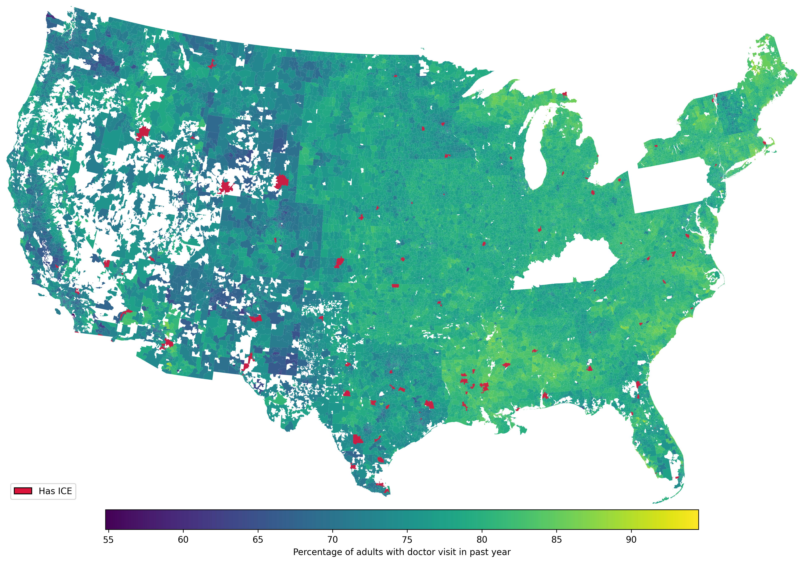
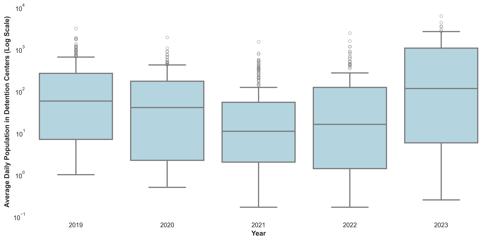
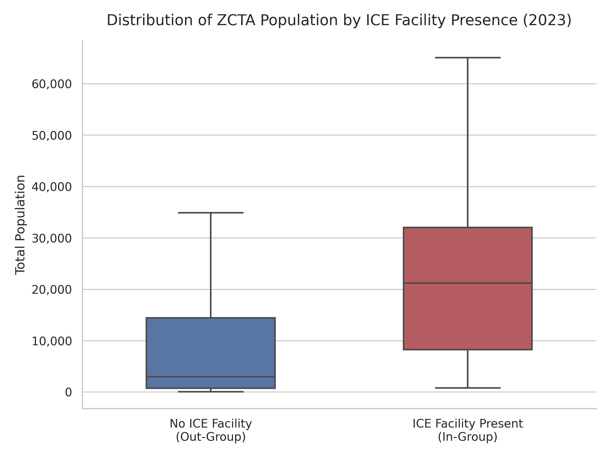

# Abstract

Background: The removal of "sensitive location" protections and increased ICE activity function can discourage people from seeking medical care by creating fear, stress, and other barriers to accessing health services, including among immigrant communities not directly targeted by enforcement.

Objective: To assess whether increased ICE enforcement correlates with reduced health care utilization.

Methods: We use national datasets on ICE detention activity and health care utilization to analyze the relationship between enforcement intensity and health care utilization across geographies and over time. We will control for potential confounders such as socioeconomic status, demographic characteristics, and local health care infrastructure.

Results: \[TBD\]

Conclusions: We found that immigration enforcement \[is/is not\] associated with reduced health care utilization. \[Implications for public health and policy TBD\]

# Introduction

Immigration-related fears appear to be negatively affecting health care access in the United States [@KFFSurvey2025]. Recent survey evidence indicates that nearly half (48%) of likely undocumented immigrant adults and 14% of immigrant adults overall report that they or a family member have avoided seeking medical care due to immigration-related concerns. These findings suggest that immigration enforcement may function as a structural barrier to health care access, even for individuals who are not directly targeted by enforcement actions. In January 2025, federal policy changes reversed prior protections that designated hospitals and other health care facilities as “sensitive locations,” limiting enforcement activity in these settings [@DHSStatement2025]. The removal of these protections may plausibly increase fears associated with seeking care, particularly in communities with visible or intensified U.S. Immigration and Customs Enforcement (ICE) activity.

Motivated by these developments, this project investigates the relationship between immigration enforcement intensity and health care utilization. Specifically, we seek to answer the question: *Does increased ICE enforcement correlate with reduced health care utilization?* We hypothesize that higher levels of local enforcement activity are associated with greater health care avoidance, as individuals may be less willing to leave their homes or engage with formal institutions perceived as potential sites of immigration enforcement.

## Background

Empirical research provides strong evidence that immigration enforcement activity reduces health care utilization among immigrant populations. At the state level, Hispanic patients were significantly less likely to report having a regular provider or annual checkup following increased ICE activity, a pattern not observed among non-Hispanic adults [@Friedman2021]. This differential response underscores how enforcement intensity functions as a racialized barrier to care. A more dramatic illustration comes from research on Secure Communities, an immigration enforcement program expanded during the Obama administration from 2008 to 2014, which found that likely authorized Hispanic immigrants experienced a 16.9% decline in the probability of visiting a health care provider compared to non-Hispanic U.S.-born respondents [@Herring2025]. Complementing these state-level findings, a survey of Asian and Latinx immigrants in California demonstrated that each additional direct experience with immigration enforcement was associated with delayed care for both groups [@Young2023].

Beyond individual-level utilization changes, enforcement has broader structural impacts on health care access. Studies using geographic measures of enforcement intensity, such as ICE detainer requests at the county level, found these requests were associated with lower Medicaid and SNAP enrollment—indicating that enforcement creates barriers to accessing public benefits and formal health care systems [@Kravitz2024]. At the regional level, Latino adults living in areas with the most detainer requests had 24% higher odds of fair/poor self-rated health compared to those in areas with the least requests, reflecting enforcement's effects on health outcomes through reduced care access [@Eastus2025]. These findings align with a comprehensive literature review synthesizing 32 studies, which documented that hostile immigrant environments correlate with decreased or delayed utilization of basic health care services [@Vernice2020].

The mechanisms linking enforcement to reduced care-seeking are increasingly well-understood through provider and qualitative research. Surveys of clinicians consistently show enforcement's disruptive effects: 48% of primary care and emergency medicine providers reported observing negative effects of ICE enforcement on their immigrant patients' health and health access [@Hacker2012], while another survey found that post-2016 anti-immigrant policies and enforcement actions led half of clinicians to report persistent fear among their immigrant patients—an effect more pronounced in border states [@Saadi2021]. Qualitative investigations reveal the emotional and structural pathways through which enforcement affects care-seeking. A 2009 study in Everett, Massachusetts found that enhanced enforcement impacted immigrant health through both emotional means (deportation fears, concerns about ICE-police cooperation) and structural barriers (anxiety about documentation requirements for enrollment and care) [@Hacker2011]. An immigration raid in a Midwestern Latino community similarly demonstrated that enforcement actions increase immigration-related stress and lower self-rated health among affected residents [@Lopez2017].

While prior studies have well-documented enforcement effects through state-level analyses, provider surveys, and local case studies, comprehensive research examining the relationship on a national scale at granular geographic and temporal levels remains limited. This project addresses this gap by using national datasets on ICE detention activity and health care utilization to analyze the enforcement-utilization relationship across geographies and over time, allowing us to quantify a relationship that prior research has established in principle but not comprehensively measured at scale.

# Methods

## Data

We utilize data on immigration enforcement, health care utilization data, and social determinants of health. Detention Facilities Average Daily Population data is available from the Transactional Records Access Clearinghouse (TRAC) and provides information on the average daily population of ICE detention facilities, broken down by city, state, ZIP code, and date from September 2019 through present [@TRACDetention2025]. This dataset will allow us to measure the intensity of local immigration enforcement activity over time and across geographies.

Routine checkup within the past year among adults data is available from CDC's PLACES data and provides information on the percentage of adults who reported having a routine checkup within the past year, broken down by county, ZIP Code Tabulation Area (ZCTA), and year from 2020-2025 [@PLACES2025]. This dataset will serve as our primary outcome variable, allowing us to assess health care utilization patterns in relation to local enforcement intensity.

We will use data from the American Community Survey (ACS) 5-Year Estimates to control for social determinants of health in our analysis [@CensusAPI]. This data provides information on social determinants of health at the ZCTA level. Social determinants of health analyzed included race, citizenship status, income, education, employment status, and housing conditions.

```{r}
#| label: unique-zctas
#| echo: false
#| warning: false
library(tidyverse, warn.conflicts = FALSE)
library(skimr)

panel_data <- read_csv("Data/panel_data2.csv", show_col_types = FALSE)

unique_zcta_count <- panel_data |>
    distinct(zcta5) |>
    nrow()
```

```{r}
#| label: tbl-descriptive-statistics
#| tbl-cap: "Descriptive statistics"
#| echo: false
#| warning: false

panel_data <- read_csv("Data/panel_data2.csv")

unique_zctas <- panel_data |>
    distinct(zcta5) |>
    pull()

fig_data <- panel_data |>
    select(
        doctor_visits_past_year,
        pct_population_in_detention,
        miles_to_nearest_facility,
        has_ice_facility,
        pct_hispanic_latino,
        pct_white,
        pct_black,
        pct_asian,
        pct_two_plus,
        pct_other_race,
        pct_non_citizen,
        median_household_income,
        pct_below_poverty,
        pct_unemployed,
        pct_high_school_or_higher,
        pct_no_internet,
        pct_no_vehicle
    ) |>
    rename(
        "Percent of adults who had a visit with a doctor or other health care professional in the past year" = doctor_visits_past_year,
        "Percent of population in ICE detention facilities" = pct_population_in_detention,
        "Hispanic/Latino" = pct_hispanic_latino,
        "White" = pct_white,
        "Black" = pct_black,
        "Asian" = pct_asian,
        "Two or more races" = pct_two_plus,
        "Other race" = pct_other_race,
        "Non-citizen" = pct_non_citizen,
        "Household income" = median_household_income,
        "Below poverty line" = pct_below_poverty,
        "Unemployed" = pct_unemployed,
        "High school education or higher" = pct_high_school_or_higher,
        "Without internet access" = pct_no_internet,
        "Without a vehicle" = pct_no_vehicle,
        "Miles to nearest detention facility" = miles_to_nearest_facility,
        "Has ICE facility" = has_ice_facility
    )

tbl_summ_stats <- fig_data |>
    skim_without_charts() |>
    janitor::clean_names() |>
    as_tibble() |>
    filter(skim_type == "numeric") |>
    rename(
        Variable = skim_variable,
        Mean = numeric_mean,
        SD = numeric_sd,
        Min = numeric_p0,
        Median = numeric_p50,
        Max = numeric_p100
    ) |>
    select(Variable, Mean, SD, Min, Median, Max) |>
    mutate(across(
        where(is.numeric),
        ~ formatC(., format = "fg", digits = 2)
    )) |>
    knitr::kable(format = "latex", booktabs = TRUE, longtable = FALSE) |>
    kableExtra::kable_styling(latex_options = c("hold_position", "scale_down"))

tbl_summ_stats

# Calculate statistics for the narrative below
med_val <- round(median(panel_data$doctor_visits_past_year, na.rm = TRUE), 1)
ice_median <- round(
    median(panel_data$average_daily_population, na.rm = TRUE),
    1
)
ice_max <- round(max(panel_data$average_daily_population, na.rm = TRUE), 1)
```

We used Python to build panel data across datasets, geographies, and years. Our panel data spans from 2018 to 2023 and includes `r format(unique_zcta_count, big.mark=",")` unique ZCTAs across the United States. @tbl-descriptive-statistics provides descriptive statistics for our key variables of interest, including the average daily population in ICE detention facilities (ADP), the percentage of adults reporting a routine checkup within the past year, and key social determinants of health across ZCTAs. The median of our main outcome variable, `r med_val`%, suggests that for the majority of the United States, annual healthcare engagement is a standard behavior. For most areas of the United States, there are no detention centers (median ADP is `r ice_median`); however, the maximum ADP reaches `r format(ice_max, big.mark=",")`, demonstrating that certain areas have a large population in detention facilities. See Appendix A for detailed Python code used in data processing and analysis.

```{r}
#| label: fig-correlation-matrix
#| fig-cap: "Correlation matrix. Note: Correlations below 0.01 are suppressed."
#| fig-width: 9
#| fig-height: 6
#| echo: false
#| warning: false
library(corrplot)

corr_matrix <- fig_data |>
    rename(
        "Doctor visits in past year" = `Percent of adults who had a visit with a doctor or other health care professional in the past year`,
        "Population in ICE detention" = `Percent of population in ICE detention facilities`
    ) |>
    select(
        "Doctor visits in past year",
        "Population in ICE detention",
        "Miles to nearest detention facility",
        "Has ICE facility",
        "Hispanic/Latino",
        "White",
        "Non-citizen",
        "Household income",
        "Below poverty line",
        "Unemployed",
        "High school education or higher",
        "Without internet access",
        "Without a vehicle",
    ) |>
    cor(use = "complete.obs")

# Hide correlations below 0.01 threshold
corr_matrix[abs(corr_matrix) < 0.01] <- NA

corrplot(
    corr_matrix,
    type = "upper",
    addCoef.col = "black",
    tl.col = "black",
    tl.srt = 45,
    number.cex = 0.8,
    tl.cex = 1,
    diag = FALSE,
    na.label = " ",
    cl.pos = "n"
)

doc_visits_corrs = corr_matrix |>
    as.data.frame() |>
    select("Doctor visits in past year") |>
    mutate(across(everything(), ~ round(., 2)))

corr_pop_in_ice = doc_visits_corrs |>
    filter(rownames(corr_matrix) == "Population in ICE detention") |>
    pull()

corr_hisp = doc_visits_corrs |>
    filter(rownames(corr_matrix) == "Hispanic/Latino") |>
    pull()

corr_citizen = doc_visits_corrs |>
    filter(rownames(corr_matrix) == "Non-citizen") |>
    pull()

corr_miles = doc_visits_corrs |>
    filter(rownames(corr_matrix) == "Miles to nearest detention facility") |>
    pull()
```

To prepare the data for analysis, we used median imputation to handle missingness, log transformed data to address skewness, and feature engineered our main independent variable of interest, ICE enforcement intensity, by creating a binary variable indicating the presence of an ICE detention facility in a ZCTA code (i.e., whether the average daily population in detention facilities is greater than 0). We also created a continuous variable measuring the distance from each ZCTA code to the nearest ICE detention facility. These two variables allow us to capture both the presence and proximity of enforcement activity, which may have distinct effects on health care utilization.

## Modeling

To analyze the relationship between immigration enforcement intensity and health care utilization, we constructed an econometric framework utilizing a Two-Way Fixed Effects (TWFE) panel regression model. Because our dependent variable—the percentage of adults who had a routine checkup in the past year—is a proportion, we estimate a linear model. The linear fixed-effects framework is highly preferred in this context as it allows for the direct inclusion of high-dimensional geographic fixed effects (thousands of ZCTA codes) while providing coefficients that are easily interpretable as percentage-point changes.

### Econometric Specification

The primary econometric specification is defined by the following equation:

$$
Y_{it} = \beta_{0} + \beta_{1} \text{Enforcement}_{it} + \Gamma \mathbf{X}_{it} + \alpha_{i} + \delta_{t} + \epsilon_{it}
$$

Where:

* $Y_{it}$ is the percentage of adults who had a routine checkup in ZCTA
* $i$ during year $t$.$Enforcement_{it}$ represents the primary independent variable of interest (e.g., proximity to an ICE facility or detention population density).
* $\Gamma \mathbf{X}_{it}$ is a vector of time-varying socioeconomic controls (race, citizenship, poverty, etc.).
* $\alpha_i$ represents ZCTA-level fixed effects, capturing all time-invariant geographic heterogeneity.
* $\delta_t$ represents year fixed effects, capturing national macro-level shocks.
* $\epsilon_{it}$ is the idiosyncratic error term, with standard errors clustered at the ZCTA level.

To capture the multidimensional nature of immigration enforcement and its localized "chilling effect," we estimate four variations of this core model:

1. **Model 1: Binary ICE Presence (TWFE)** – This model utilizes a binary indicator (has_ice_facility) for the physical presence of an ICE detention facility within a ZCTA. This captures the immediate, localized impact of enforcement infrastructure on the resident population.

2. **Model 2: Logarithmic Distance to Facility** – To assess how the enforcement effect scales geographically, this model uses the natural logarithm of the distance (in miles) to the nearest ICE facility. The logarithmic transformation accounts for the non-linear relationship where changes in proximity matter most when a population is already relatively close to a facility.

3. **Model 3: Regional Chilling Effect (50-Mile Threshold)** – This model employs a binary indicator for ZCTAs located within a 50-mile radius of a detention center. This threshold tests whether the "chilling effect" extends beyond the immediate vicinity into broader commuter and social zones.

4. **Model 4: Distance Decay Gradient** – This model replaces the single binary threshold with a series of distance bins (0–10 miles, 10–25 miles, and 25–50 miles). This allows us to test for a distance decay effect—the hypothesis that the reduction in healthcare utilization is most severe in immediate proximity to enforcement activity and monotonically diminishes as distance increases.

### Identification Strategy

A central advantage of the TWFE framework (utilized explicitly in Model 1) is that the coefficient of interest, $\beta_1$, is identified primarily by "switchers"—ZCTAs that experienced a change in their enforcement status (e.g., the opening or closing of an ICE facility) during the 2018–2023 sample period. ZCTAs with constant enforcement levels throughout the period serve as the control group to establish the counterfactual time trend.The validity of this approach relies on the parallel trends assumption: the assumption that in the absence of changes to ICE enforcement, healthcare utilization in "treated" ZCTAs would have trended parallel to those in "control" ZCTAs. Furthermore, because our study period overlaps with the COVID-19 pandemic—which caused a universal, severe decline in routine medical visits—the inclusion of year fixed effects ($\delta_t$) is critical. These year parameters absorb national-level pandemic fluctuations, ensuring that our estimates isolate the variation in healthcare utilization associated strictly with local enforcement intensity rather than global health shocks.

### Controls and Variable Selection

To isolate the effect of ICE enforcement, we must account for underlying socioeconomic and demographic factors that simultaneously influence healthcare access and vulnerability to immigration enforcement. Initially, a broad suite of variables was considered, including race, citizenship status, poverty rates, education levels, unemployment, and housing conditions (rent burden, vehicle access, and internet access).Because demographic indicators are often highly correlated (e.g., race, poverty, and rent burden), including all variables can lead to severe multicollinearity, which inflates standard errors and destabilizes coefficient estimates. To address this, we conducted a Variance Inflation Factor (VIF) diagnostic on the full set of controls. Based on the VIF results, we refined our control vector ($\mathbf{X}_{it}$) to a parsimonious set of independent variables that effectively capture local vulnerability without introducing excessive collinearity. The final models control for:Percentage of the population below the poverty linePercentage of non-citizensMedian household incomePercentage of the population identifying as WhitePercentage of the population with a Bachelor's degree or higherPercentage of the population unemployed

### Estimation and Inference

In longitudinal panel data, observations within the same geographic unit over time are not independent. A ZCTA's healthcare utilization rate in 2018 is highly predictive of its rate in 2019. If this serial autocorrelation is ignored, standard errors will be artificially small, leading to an overstatement of statistical significance.To ensure robust inference, all models were estimated with standard errors clustered at the ZCTA level. Clustering at the entity level adjusts the standard errors to account for both heteroskedasticity and arbitrary correlation of the error terms ($\epsilon_{it}$) within each ZIP code over time, providing a conservative and rigorous test of our hypotheses.

1.  **Model 1: ICE Presence** - This model includes the binary variable indicating the presence of an ICE detention facility in a ZCTA code as the main independent variable, controlling for confounders and fixed effects.

2.  **Model 2: Distance to Nearest Facility** - This model includes the continuous variable measuring the distance from each ZCTA code to the nearest ICE detention facility as the main independent variable, controlling for confounders and fixed effects.

3.  **Model 3: Regional Chilling Effect** - This model includes a binary variable indicating whether a ZCTA code is within 50 miles of an ICE detention facility as the main independent variable, controlling for confounders and fixed effects.

4. **Model 4: Distance Decay Gradient** – This replaces the single binary threshold with a series of distance "bins": 0–10 miles, 10–25 miles, and 25–50 miles. This allows us to test for a distance decay effect—the hypothesis that the reduction in healthcare utilization is most severe in the immediate proximity of enforcement activity and diminishes as distance increases.

## Results

@fig-correlation-matrix provides a visual representation of the correlations between a subset of our analysis variables. The size of the population in ICE detention facilities does not seem correlated with the rate of doctor visits in a particular area (r = `r corr_pop_in_ice`). Hispanic/Latino ethnicity and citizenship status are much stronger correlates with doctor visits (r = `r corr_hisp` and r = `r corr_citizen`, respectively, suggesting that Hispanic/Latino folks and non-citizens are less likely to have had a recent doctor's visit). The distance to the nearest ICE detention facility has a slight negative correlation with doctor visits (r = `r corr_miles`), which may suggest that proximity to enforcement activity could be associated with reduced health care utilization, although this relationship is not strong.

<!-- Map of doc visits -->

{#fig-map-ice-overlay-doctor-visits width="60%"}

We visualized a 2023 snapshot geographic distribution of health care utilization and ICE detention centers across the U.S. in @fig-map-ice-overlay-doctor-visits. This map shows that rates of adults' annual doctor visits vary across the country, with higher rates in the southeast, and lower rates in the west, although it should be noted that there is significant missingness in the west of the country. The spatial distribution of ICE detention centers (in red) illustrates the concentrated nature of federal enforcement infrastructure, particularly along the southern border.

<!-- Box plots of detention facility population size -->

{#fig-boxplot-avg-dly-pop-by-year width="80%"}

@fig-boxplot-avg-dly-pop-by-year shows that population in detention facilities dropped after 2020, but has been increasing since 2021. The interquartile range also appears to widen in the later years, suggesting that while many ZCTAs continue to have low ADP, a growing number of ZCTAs are experiencing higher levels of enforcement activity.

```{r}
#| label: tbl-model-summary
#| tbl-cap: "Model Summary Results"
#| echo: false
#| warning: false
library(kableExtra)

model_summary_table <- read_csv("Data/model_summary_table.csv")

model_summary_table |>
    knitr::kable(format = "latex", booktabs = TRUE, longtable = FALSE) |>
    kableExtra::kable_styling(latex_options = c("hold_position", "scale_down"))
```

@tbl-model-summary provides a summary of the results from our four spatial and temporal regression models. As expected in highly granular geographic panel data, the explanatory power of the time-varying predictors is minimal once fixed effects are applied. Model 1 yields a Within R-squared of effectively zero (-0.008). This indicates that the vast majority of the variance in healthcare utilization is cross-sectional (between different ZCTAs) and driven by national temporal shocks (the pandemic), rather than year-to-year within-ZCTA fluctuations in enforcement or demographics.

Regarding the primary hypothesis, the results of the TWFE specification (Model 1) indicate that the presence of an ICE facility within a ZCTA does not have a statistically significant localized effect on healthcare utilization. The coefficient for binary ICE presence is negative (-0.177), aligning with the theory of a chilling effect, but it is not statistically significant ($p = 0.119$). This suggests that year-to-year changes in enforcement infrastructure within a specific ZIP code do not independently drive detectable changes in routine doctor visits once macro-level pandemic shocks and static geographic features are controlled for.

Interestingly, our cross-sectional spatial models (Models 2, 3, and 4) reveal a highly significant relationship in the opposite direction of the hypothesized chilling effect. Model 2 demonstrates that as the logarithmic distance to a facility increases, healthcare utilization decreases ($\beta = -0.572, p < 0.001$). Model 3 reinforces this, showing that ZCTAs within 50 miles of an ICE facility actually report a 0.785 percentage-point higher rate of doctor visits compared to those further away.

Model 4 provides the most granular view of this dynamic through a distance decay gradient. The positive association with healthcare utilization is strongest in the immediate vicinity of an ICE facility (0–10 miles: $\beta = 0.987, p < 0.001$) and monotonically decays as distance increases (10–25 miles: $\beta = 0.874$; 25–50 miles: $\beta = 0.682$).

Rather than disproving the existence of enforcement-related fear, this strong positive gradient likely highlights a critical spatial confounder: urbanicity. ICE detention centers and federal enforcement hubs are disproportionately located in or adjacent to metropolitan areas, which inherently possess robust, highly accessible healthcare infrastructure (e.g., hospitals, public transit, and safety-net clinics). Therefore, in these spatial models, proximity to an ICE facility is likely acting as a proxy for healthcare access. This underscores the necessity of the TWFE approach (Model 1), which successfully strips away this static urban advantage to isolate the true, albeit statistically insignificant, temporal effect of enforcement changes.

{#fig-boxplot-population-ice width="80%"}

@fig-boxplot-population-ice illustrates the stark population differences between ZCTAs with and without ICE facilities. The median population of ZCTAs with an ICE facility is 21,212, while the median population of ZCTAs without an ICE facility is 2,985. This great difference does lend support to the idea that the positive association between proximity to an ICE facility and healthcare utilization is likely driven by the confounding influence of urbanicity and healthcare infrastructure, rather than a true "chilling effect." The presence of an ICE facility is likely acting as a proxy for being in or near a metropolitan area with greater healthcare access, which could explain the positive association observed in the spatial models.

::: Naomi Callout - So our R^2 within isn't really applicable for the 2nd, 3rd, and 4th models because we do not use entity effects (in the ipynb this is entity_effects=false). This was turned off because the distance between the ZCTA and the nearest ICE facility does not change with year (static).  


# Discussion

Our analysis did not find statistically significant evidence of a localized decrease in healthcare utilization associated with the introduction or presence of an ICE detention facility within a ZCTA. Conversely, our spatial cross-sectional models revealed a strong, highly significant positive association between proximity to ICE facilities and routine doctor visits.

Rather than disproving the "chilling effect," this positive gradient powerfully illustrates the confounding influence of urbanicity. ICE detention infrastructure is disproportionately anchored in densely populated, transit-accessible metropolitan areas, which inherently possess robust healthcare systems and safety-net clinics. Therefore, in spatial models, proximity to an ICE facility inadvertently acts as a proxy for healthcare access. This dynamic underscores the necessity of our Two-Way Fixed Effects (TWFE) approach. By controlling for time-invariant geographic advantages, the TWFE model successfully stripped away this urbanicity confounder, revealing that year-to-year changes in enforcement infrastructure do not independently drive detectable changes in aggregate healthcare utilization.

This finding adds vital quantitative context to existing qualitative literature. While clinician surveys and qualitative studies thoroughly document the acute fear and healthcare avoidance experienced by immigrant communities, our results suggest this avoidance does not manifest as a statistically significant drop in aggregate, ZCTA-level data. Because vulnerable and undocumented immigrants represent only a fraction of a given ZCTA's total population, severe reductions in their healthcare utilization are likely mathematically masked by the stable utilization patterns of the broader citizen population.

## Limitations

This study faces several limitations regarding data structure and geographic coverage. Primarily, the reliance on aggregated CDC PLACES data introduces the risk of the ecological fallacy; because the data provides modeled estimates at the ZCTA level, we cannot observe individual patient behavior. Consequently, severe chilling effects experienced by undocumented subpopulations may be mathematically masked by aggregate stability. Furthermore, the outcome data contains significant geographic missingness—particularly in Kentucky, Pennsylvania, and much of the western United States—which may introduce regional bias. Statistically, the dataset is also highly unbalanced. Because very few ZCTAs nationwide actually host an ICE detention facility, the limited exposure variation reduces the statistical power necessary to identify stable effects.

Secondly, there are limitations in our variable specification. Our models did not explicitly account for localized healthcare infrastructure (e.g., distance to the nearest hospital or clinic density). This omission is precisely what allowed our spatial models to absorb the "urbanicity confounder" discussed previously, making it difficult to isolate enforcement effects from general healthcare access. Finally, our main independent variable—the presence of an ICE facility—is a relatively blunt proxy for enforcement intensity. A static facility does not capture the acute lived experiences of communities, such as the psychological impact of local ICE raids, workplace enforcement operations, or mobile checkpoints.

## Policy Implications

Our findings have significant implications for public health monitoring and resource allocation. Because robust urban healthcare infrastructure mathematically masks localized chilling effects in aggregate datasets, public health officials cannot rely on stable, ZCTA-level utilization rates as proof of equitable healthcare access. Policymakers must recognize that stable clinic volume in a metropolitan ZIP code may obscure severe, fear-driven healthcare avoidance among undocumented subpopulations. Consequently, public health interventions and funding cannot rely solely on geographic accessibility metrics; rather, they must prioritize targeted, community-partnered outreach to ensure that vulnerable populations are actually utilizing the infrastructure that surrounds them.

## Future Research

To build upon this analysis, future research must transition from static geographic proxies of enforcement to dynamic, event-driven measurements. Incorporating data on acute, highly visible enforcement actions—such as localized ICE raids, workplace sweeps, and mobile checkpoints—would provide a much more precise measure of enforcement intensity. By evaluating temporal spikes in these acute events alongside high-frequency health data (e.g., monthly clinic no-show rates), researchers could more accurately capture the immediate, localized shocks to healthcare utilization. Furthermore, future spatial analyses must incorporate explicit geographic controls for healthcare access, such as hospital proximity and provider availability, to successfully isolate the effect of enforcement from underlying urban infrastructure. Finally, prioritizing datasets with complete national geographic coverage will be essential to strengthening the robustness and generalizability of these findings.

# Conclusion

This study set out to rigorously quantify the hypothesized "chilling effect" of immigration enforcement on healthcare utilization at a national scale. Utilizing a highly granular, ZCTA-level panel dataset spanning 2018 to 2023, we found no statistically significant evidence that the introduction or localized presence of an ICE detention facility reduces aggregate routine medical visits over time.

Importantly, our spatial analysis highlighted a critical methodological trap in evaluating immigration enforcement: a strong, highly significant positive correlation between proximity to ICE infrastructure and healthcare access. Rather than disproving the chilling effect, this finding powerfully illustrates that federal enforcement is disproportionately anchored in densely populated urban hubs equipped with robust healthcare systems. Only through the rigorous application of a Two-Way Fixed Effects framework were we able to isolate and strip away this "urbanicity confounder." This demonstrates that relying purely on cross-sectional spatial models is insufficient—and potentially deeply misleading—when evaluating the localized impacts of enforcement.

Ultimately, the absence of a statistically significant drop in aggregate healthcare utilization does not invalidate the profound fear and avoidance behaviors documented extensively in qualitative public health literature. Instead, it exposes the inherent limitations of geographic aggregation. Because undocumented and vulnerable immigrants represent only a fraction of any given ZCTA, their localized healthcare avoidance is mathematically eclipsed by the stable routines of the broader citizen population.

As immigration enforcement remains a highly active and volatile fixture of federal policy, public health officials must not mistake aggregate statistical stability for equitable access. Ensuring that immigrant communities can safely seek medical care requires moving beyond high-level geographic assumptions. It demands targeted community outreach, the pursuit of event-driven and disaggregated health data, and a critical recognition that proximity to a hospital does not guarantee the safety to walk through its doors.

# References